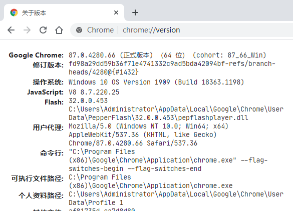
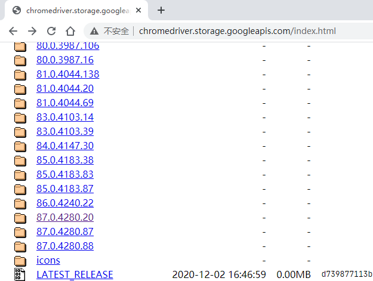
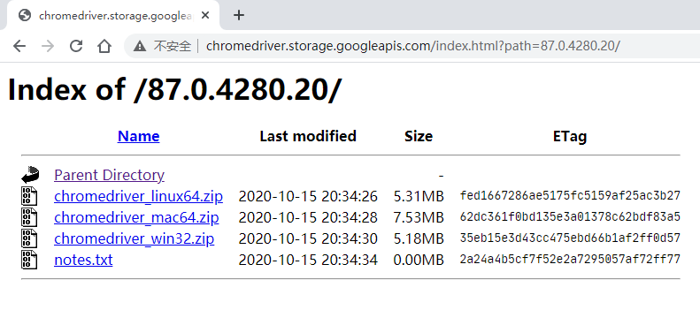
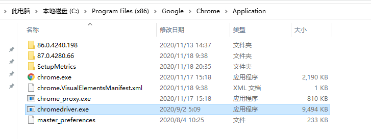
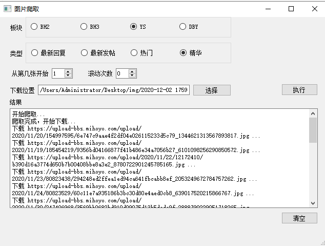

## 环境准备

1. chrome浏览器
   
2. 在地址栏输入chrome://version 查看chrome版本
   

3. 在 [地址](http://chromedriver.storage.googleapis.com/index.html) 或 [镜像地址](http://npm.taobao.org/mirrors/chromedriver/) 下载对应版本的 chrome driver，windows系统下载win32那个文件即可
  
  
4. 将下载下来的chromedriver.exe放到chrome的根目录下，位置可以通过右键浏览器图标打开文件所在位置或在版本信息那张图的可执行文件路径找到
   

## 说明

- 点击执行会打开chrome的临时浏览器进行网页爬取，在获取完页面的图片信息后会进行下载（下载间隔：0.5s）。
  
- 若想打开有个人配置信息的浏览器，需要在spider_mihoyo.py处添加自己的浏览器配置文件目录。配置文件目录在版本信息图的个人资料路径处有，到User Data目录为止。配置完后运行main.py文件。

    `chrome_options.add_argument("--user-data-dir="+r"配置文件目录")`

    **例子**
    ```
    chrome_options = Options()
    # 配置打开的浏览器
    chrome_options.add_argument("--user-data-dir="+r"C:/Users/Administrator/AppData/Local/Google/Chrome/User Data")

    browser = webdriver.Chrome(chrome_options=chrome_options)
    ```

## 注意事项
- 运行崩溃可以尝试先关闭浏览器


## 存在问题
- 使用临时浏览器打开时，每执行一次都会打开一个新的浏览器